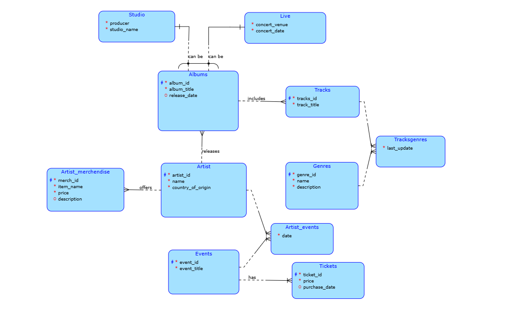

# Music Management Database

## Overview
This project represents a database schema for managing music-related data. The schema is designed to handle information about artists, albums, events, merchandise, and tracks. It provides a robust structure to store and query music-related data efficiently.

---

## Features
- Manage **Artists** and their **Albums**.
- Track **Events** and **Tickets** sold.
- Maintain **Genres** and **Tracks** metadata.
- Support **Merchandise** linked to specific artists.
- Handle **Live** and **Studio** album classifications.

---

## Database Schema Diagram
Below is the database schema that represents the relationships and data structure:



### Key Highlights:
- **Artist**: Stores artist details.
- **Albums**: Linked to artists and classified as either live or studio albums.
- **Tracks**: Part of albums with associated genres.
- **Events**: Tracks artist participation in events.
- **Tickets**: Records ticket sales for events.
- **Merchandise**: Linked to artists for their product sales.

---

## Table Overview
### **Artist**
- **ArtistID (PK)**: Unique identifier for each artist.
- **Name**: Name of the artist.
- **CountryOfOrigin**: The country where the artist originates.

### **Album**
- **AlbumID (PK)**: Unique identifier for each album.
- **ArtistID (FK)**: Links the album to the artist.
- **AlbumTitle**: The name of the album.
- **ReleaseDate**: When the album was released.

### **Tracks**
- **TracksID (PK)**: Unique identifier for each track.
- **AlbumID (FK)**: Links the track to the album it belongs to.
- **TrackTitle**: The name of the track.

### **Genres**
- **GenreID (PK)**: Unique identifier for each genre.
- **Name**: Name of the genre.
- **Description**: Description of the genre.

### **TracksGenres**
- **GenreID (FK)**: Links the track to its genre.
- **TracksID (FK)**: Links the genre to the track.
- **LastUpdate**: Timestamp of the last update.

### **Events**
- **EventID (PK)**: Unique identifier for each event.
- **EventTitle**: The name of the event.

### **ArtistEvents**
- **ArtistID (FK)**: Links the artist to the event.
- **EventID (FK)**: Links the event to the artist.
- **Date**: Date of the event.

### **Merchandise**
- **MerchID (PK)**: Unique identifier for each merchandise item.
- **ArtistID (FK)**: Links the merchandise to the artist.
- **ItemName**: Name of the merchandise item.
- **Price**: Price of the item.
- **Description**: Description of the item.

### **Tickets**
- **TicketID (PK)**: Unique identifier for each ticket.
- **EventID (FK)**: Links the ticket to the event.
- **Price**: Price of the ticket.
- **PurchaseDate**: Date the ticket was purchased.

### **Live Albums**
- **AlbumID (PK)**: Unique identifier for the album.
- **ConcertVenue**: Venue of the concert.
- **ConcertDate**: Date of the concert.

### **Studio Albums**
- **AlbumID (PK)**: Unique identifier for the album.
- **Producer**: Name of the producer.
- **StudioName**: Name of the studio.

---

## Installation & Setup

### **Prerequisites**
- PostgreSQL 13+ installed on your system.
- A database management tool like `pgAdmin` or `DataGrip`.

### **Steps**
1. Clone the repository:
   ```bash
   git clone https://github.com/username/music-db.git
   cd music-db


